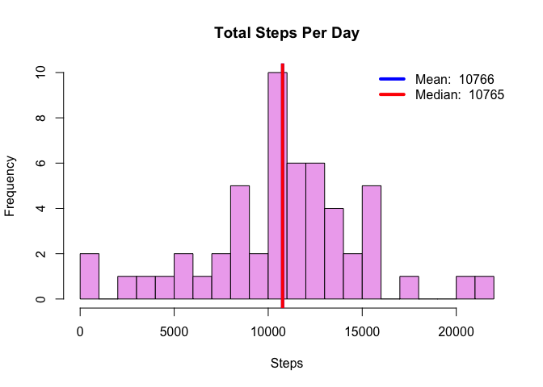
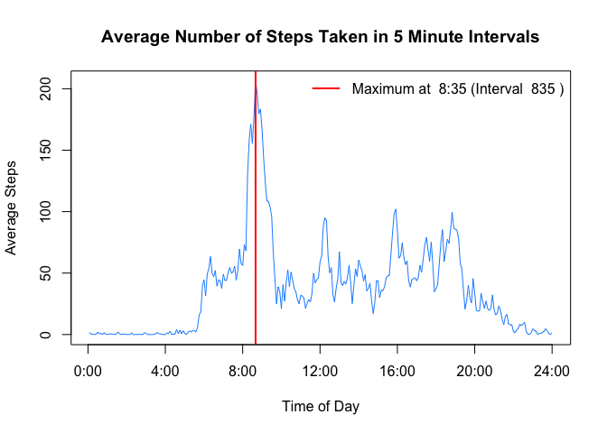
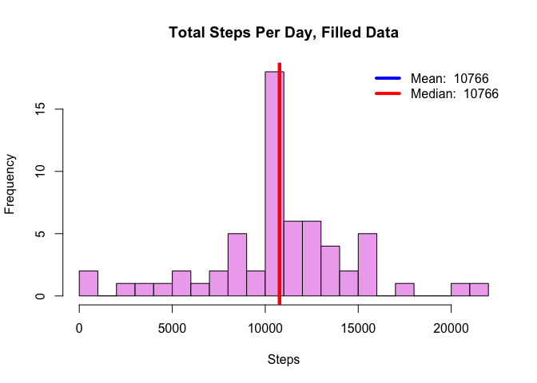
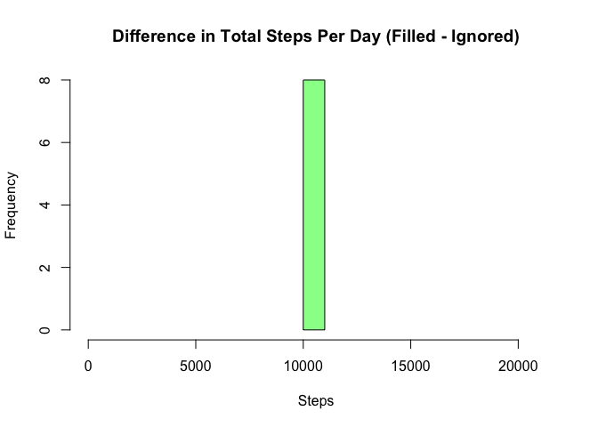
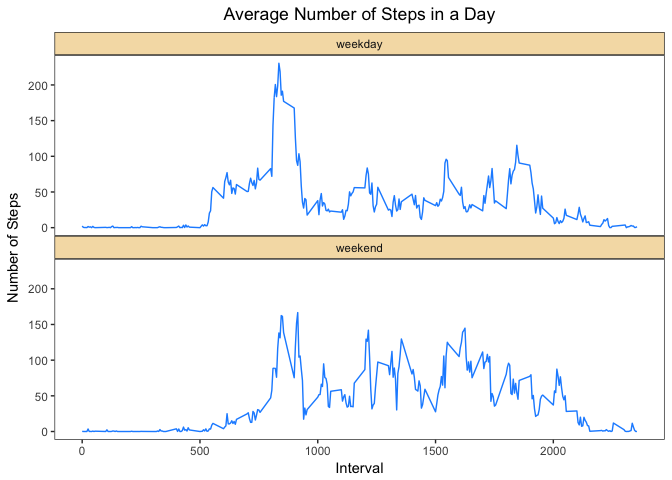

# Reproducible Research: Peer Assessment 1


## Loading and preprocessing the data

```r
library(dplyr)
```

```
## 
## Attaching package: 'dplyr'
```

```
## The following objects are masked from 'package:stats':
## 
##     filter, lag
```

```
## The following objects are masked from 'package:base':
## 
##     intersect, setdiff, setequal, union
```

```r
library(ggplot2)
data <- read.csv(unz("activity.zip", "activity.csv"),
                 colClasses = c("integer","factor", "factor"))
```

## What is mean total number of steps taken per day?

```r
# for each date, sum the steps
totalStepsPerDay  <- tapply(data$steps, data$date, sum)

# calculate mean, median
meanStepsPerDay   <- mean(totalStepsPerDay, na.rm=T)
medianStepsPerDay <- median(totalStepsPerDay, na.rm=T)
meanString   <- paste("Mean: ", as.integer(meanStepsPerDay))
medianString <- paste("Median: ", as.integer(medianStepsPerDay))

# hist
hist(totalStepsPerDay, main="Total Steps Per Day", xlab="Steps",col ="plum2", breaks=20)
abline(v=meanStepsPerDay, col="blue", lwd=4)
abline(v=medianStepsPerDay, col="red", lwd=4)
legend("topright", c(meanString, medianString), col = c("blue", "red"), lty = 1, lwd=4, bty='n')
```

<!-- -->


## What is the average daily activity pattern?

```r
# for each interval, average the steps
steps <- tapply(data$steps, data$interval, mean, na.rm=T)

# columns are intervals, average steps per interval
dailySteps <- as.data.frame(cbind(as.integer(names(steps)), steps)) 
colnames(dailySteps) <- c("interval", "meanSteps")
dailySteps <- dailySteps[order(as.integer(dailySteps$interval)),]

# get time string from interval
getTimeString <- function (x) {
      y <- as.character(x)
      if (nchar(y) < 3) {
            y
      } else {
            z <- as.integer(y)
            hours <- as.integer(z/100)
            minutes <- z - hours*100
            minutesString <- ifelse(minutes >= 10, minutes, paste0("0", minutes) )
            paste0(hours, ":", minutesString)
      }
}

# get the times from interval
times <- character(288)
for (i in seq_along(dailySteps$interval)) times[i] <- getTimeString(dailySteps$interval[i])

# find the time of the max value of steps
maxInterval <- which.max(dailySteps$meanSteps) 
maxTime     <- times[maxInterval] 
actualInterval <- dailySteps$interval[maxInterval]
maxString <- paste("Maximum at ", maxTime, "(Interval ", actualInterval, ")" )      

# plot
plot(dailySteps$meanSteps, type="l", xlab="Time of Day", ylab="Average Steps", 
     main="Average Number of Steps Taken in 5 Minute Intervals",  xaxt="n", col="dodgerblue")
axis(1, labels = c("0:00", "4:00", "8:00", "12:00","16:00", "20:00","24:00"), 
            at = c( 0,   48,     96,     144,    192,     240,    288))
abline(v=maxInterval, col="red", lwd=2)
legend("topright", maxString, col="red", lty=1, lwd=2, bty='n')
```

<!-- -->


## Imputing missing values

```r
# number of rows with missing data
numNARows   <- sum(is.na(data$steps)); print(numNARows)
```

```
## [1] 2304
```

```r
# number of days with some and all missing data are the same!
numNAPerDay <- data %>% group_by(date) %>% summarise(sum=sum(is.na(steps)))
numDayWithSomeNA <- sum(numNAPerDay$sum > 0);   print(numDayWithSomeNA)
```

```
## [1] 8
```

```r
numDayWithAllNA <- sum(numNAPerDay$sum == 288); print(numDayWithAllNA)
```

```
## [1] 8
```

```r
# Fill missing with interval average
for(i in seq_along(data$steps)) {
      step     <- data$steps[i]
      interval <- data$interval[i]
      replacementStep <- dailySteps$meanStep[which(dailySteps$interval==interval)]
      data$filledSteps[i] <- ifelse(is.na(step), replacementStep, step)
}

# for each date, sum the steps
totalStepsPerDayFilled  <- tapply(data$filledSteps, data$date, sum, na.rm=T)

# get mean, median
meanStepsPerDayFilled   <- mean(totalStepsPerDayFilled)
medianStepsPerDayFilled <- median(totalStepsPerDayFilled)
meanStringFilled   <- paste("Mean: ", as.integer(meanStepsPerDayFilled))
medianStringFilled <- paste("Median: ", as.integer(medianStepsPerDayFilled))

# get the difference between filled and not filled
totalStepsDiff <- subset(totalStepsPerDayFilled, is.na(totalStepsPerDay))

# hist for filled
hist(totalStepsPerDayFilled, main="Total Steps Per Day, Filled Data", 
     xlab="Steps",col ="plum2", breaks=20)
abline(v=meanStepsPerDayFilled, col="blue", lwd=4)
abline(v=medianStepsPerDayFilled, col="red", lwd=4)
legend("topright", c(meanStringFilled, medianStringFilled), col = c("blue", "red"), lty = 1, lwd=4, bty='n')
```

<!-- -->

```r
# hist for difference
hist(totalStepsDiff, main="Difference in Total Steps Per Day (Filled - Ignored)", 
     xlab="Steps", col="palegreen", xlim=c(0,21194))
```

<!-- -->

When data is missing in this dataset, the whole day is missing.  The number of days with some missing data (8) is equal to the number of days with all data missing (8).  That means that when we impute the missing data as the average value for the interval, the day's total becomes the average day's total (10766.19).  The difference between the original total per day and the filled in total per day will be  8 values of 10766.19, which happens to be the peak value.  Because we were calculating a total per day, any choice of value to substitute for the NA values would add 8 additional identical entries.  

## Are there differences in activity patterns between weekdays and weekends?

```r
# add column to indicate weekend or weekday
data$days <- ifelse( weekdays( as.Date(as.character(data$date), "%Y-%m-%d")) %in%
                               c("Saturday","Sunday"), "weekend", "weekday")

# for each interval and weekend status, average the steps
steps <- data %>% group_by(days, interval) %>% summarize(mean(filledSteps))

# change interval to integer and days to factor with better column names 
steps$interval <- as.integer(as.character(steps$interval))
steps <- transform(steps, days = factor(days))
colnames(steps) <- c("days", "interval", "filledSteps")

# plot
ggplot(steps, aes(x=interval, y=filledSteps, group=days), color="dodgerblue") +
      geom_line(color='dodgerblue') + theme_bw() + 
      labs(title="Average Number of Steps in a Day", x="Interval", y="Number of Steps") +
      facet_wrap( ~ days, ncol=1) +
      theme(strip.background = element_rect(fill = "wheat"),
            panel.spacing.y = unit(0, "lines"),
            panel.grid.major = element_blank(), 
            panel.grid.minor = element_blank(),
            plot.title = element_text(hjust = 0.5))
```

<!-- -->
